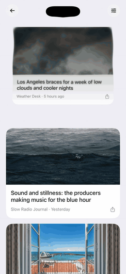
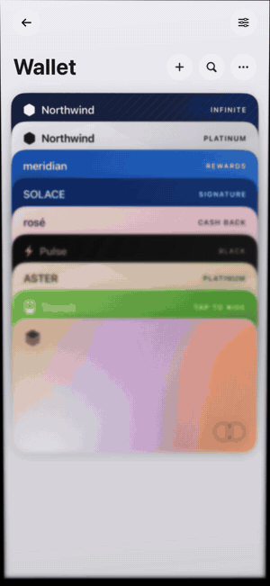
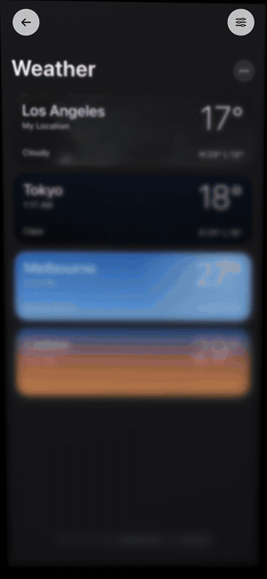
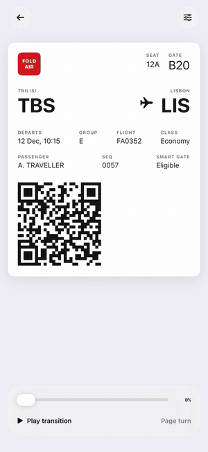

# Foldy reference

Frosted-glass fold effects for Apple platforms, rendered with Metal. SwiftUI, UIKit, and AppKit; iOS 17+, macOS 14+, watchOS 10+; Swift 6, no dependencies.

Inspired by iPhone Duo and adapted from [DuoLikeAnimation](https://github.com/elijah-semyonov/DuoLikeAnimation).
An independent visual recreation, not Apple's implementation or a physical display-handoff API.

<p align="center">
  
  
  
  
</p>

<p align="center">Recorded on an iPhone Air. Every frame is the shader; nothing is composited.</p>

[Landing page](https://tornikegomareli.github.io/foldy-landing/) · [Showcase](Showcase.png) · [How the shader works](Shader.md) · [Verification record](Verification.md)

## Installation

Swift Package Manager:

```swift
dependencies: [
    .package(url: "https://github.com/insanearts/foldy.git", from: "0.1.0")
]
```

Or in Xcode: File → Add Package Dependencies.
The Metal shader ships in the package resource bundle. Nothing needs to be copied into your app.

## Quick start

Fold one screen into another. Zero shows the source, one the destination:

```swift
import SwiftUI
import Foldy

struct Example: View {
    @State private var progress = 0.0

    var body: some View {
        FoldTransition(progress: progress) {
            FirstScreen()
        } destination: {
            SecondScreen()
        }
        .foldSwipe(progress: $progress)
        .onTapGesture { withAnimation(.easeInOut(duration: 0.8)) { progress = 1 } }
    }
}
```

`foldSwipe` lets a swipe in any direction drive the fold and settle on the nearer endpoint. It attaches a UIKit pan to the fold container, so the content stays tappable; for a view with no container, pass `placement: .surface`.
Tilt a single view like a pane of frosted glass instead:

```swift
Card().foldEffect(angle: .degrees(30))
```

## What's in the box

| | |
| --- | --- |
| `FoldTransition` | Fold between two SwiftUI views; both keep their state |
| `.foldEffect(angle:)` / `.foldEffect(tilt:)` | Tilt one view on one or two axes |
| `.foldSwipe(progress:)` | Drive any fold with a swipe; content stays tappable |
| `FoldPager` | Page or grid-navigate a list of items with page turns; swipes and nudges built in |
| `FoldCutout`, `FoldCutoutPull`, `FoldCutoutSnap`, `FoldCutoutGhost` | Pull rows into the Dynamic Island as they scroll, with magnetic settling |
| `FoldMotionSource` | Calibrated device tilt and nudge detection, with the reference demo's sampling |
| `FoldStyle` and `FoldAppearance` | Hinge, optics, choreography, viewpoint, and six glass materials |
| `FoldContainerView` | The UIKit core, for view controllers and custom snapshots |

## SwiftUI transition

```swift
import Foldy
import SwiftUI

struct Example: View {
    @State private var progress = 0.0

    var body: some View {
        VStack {
            FoldTransition(progress: progress) {
                Text("First screen").frame(maxWidth: .infinity, maxHeight: .infinity)
                    .background(.orange)
            } destination: {
                Text("Second screen").frame(maxWidth: .infinity, maxHeight: .infinity)
                    .background(.indigo)
            }
            .frame(height: 360)
            .clipShape(.rect(cornerRadius: 24))

            Button("Fold") {
                withAnimation(.easeInOut(duration: 0.65)) { progress = 1 }
            }
            Slider(value: $progress, in: 0...1)
        }
    }
}
```

Zero shows the source; one shows the destination. Reverse progress to return to the source.
Changing directly between endpoints without animation replaces the view immediately.
The container fills its proposed size. Give individual cards, labels, or icons an explicit frame.
Both content hierarchies retain their identity and local state while the container remains mounted.
The adapter forwards environment values and injected observable models into both hosted hierarchies.
Preferences, such as toolbar and navigation-title preferences, do not cross the hosting boundary; configure them on the outer container.

Use `.onFoldEvent { event in ... }` for endpoint and cancellation events. SwiftUI delivers these asynchronously on the main actor.
Keep the two content closures stable throughout a transition; commit external navigation changes after completion.
There is no automatic interception of `NavigationStack`, sheets, or UIKit navigation.

## Single-view tilt

```swift
content
    .foldEffect(angle: .degrees(35))
    .frame(height: 360)
```

Positive angles hinge on the right; negative angles hinge on the left. Angles are limited to ±90 degrees.
For both axes, use `.foldEffect(tilt: FoldTilt(horizontal: 0.3, vertical: 0.2))`; both values are radians.
Positive vertical tilt keeps the top edge fixed; negative vertical tilt keeps the bottom edge fixed.
This mode follows the demo's stationary-content, moving-glass model.
Content is captured when leaving zero. Return to zero to reveal live content and refresh the next capture.

## Paging with folds

`FoldPager` shows one item at a time and folds between them. A swipe left turns to the next item, right to the previous; with `columns` the items form a grid and swipes up and down move by row. Hand it a `FoldMotionSource` to also move on a nudge of the phone.

```swift
@State private var index = 0

FoldPager(items: places, columns: 3, selection: $index, motion: motion) { place in
    PlaceCard(place)
}
```

Set `selection` yourself to turn a page from code. Consecutive vertical moves hinge on alternating edges.

## Folding into the Dynamic Island

`FoldCutout.detect(safeAreaTop:screenWidth:)` returns the island or notch frame, measured on the simulator for current phones. `FoldCutoutPull` is a modifier that folds a view from where it is into that frame: it frosts, shrinks to the pill, converges on its center, and slips under it. Its top edge is clamped to the pill's underside, so the view never rises above the island and always vanishes inside its width.

```swift
let cutout = FoldCutout.detect(safeAreaTop: insets.top, screenWidth: width) ?? .placeholder(screenWidth: width)

card.modifier(FoldCutoutPull(progress: pull, start: cardFrame, target: cutout.frame))
```

Pass `liquid: true` and the view is swallowed like liquid: the glass ripples, its lifted edge dissolves into a band of black goo, beads between the band and the island join into a tendril as the view closes in, and the pair merge into the pill. The island reacts too: a mouth bulges toward the view and ripples run around its outline as it closes in, then `settle` plays a decaying oscillation once the view is inside. Scrolling back runs it the other way: the island winds up and the view is born from its mouth on a tendril that thins as the view descends. `FoldCutoutGhost` drives `settle` in both directions. The goo is a blurred and thresholded silhouette, the metaball technique, drawn with a SwiftUI `Canvas`. Both demo feeds use it.
For a scrolling list, hide each row as it crosses a fold line and draw a `FoldCutoutGhost` in its place; the ghost follows the scroll on a slow drag and runs its own clock on a flick, so the fold is never skipped. `FoldCutoutSnap` is a `ScrollTargetBehavior` that keeps a scroll from resting with a row half inside the cutout. It settles well clear of the fold zone on either side, so a release never re-triggers the fold. The demo's story feed and photo grid show the full pattern.

## UIKit

```swift
let fold = FoldContainerView(source: firstView, destination: secondView)
view.addSubview(fold)
fold.frame = view.bounds
fold.autoresizingMask = [.flexibleWidth, .flexibleHeight]

fold.onEvent = { event in print(event) }
fold.animate(to: .destination)
// Or drive an interactive gesture:
fold.setProgress(0.4)
// Restore the endpoint where the session began:
fold.cancel()
```

Use `FoldContainerView(content:)` with `setAngle(_:)` or `setTilt(_:)` for a single UIKit view. Angles use radians.
Foldy owns the supplied views' frames and visibility. Use distinct views for source and destination.
When supplying controller views, the app must establish normal child-controller containment.
The SwiftUI adapter establishes that containment for its hosting controllers.

`animate(to:duration:)` uses a display link only while animating. A new animation retargets from current progress.
`setProgress(_:)` stops an existing timed animation so a gesture can take over.

## Capture contract

The Metal renderer uses frozen snapshots during a fold, then restores the real view at an endpoint.
It captures visible scrolling content; offscreen rows are not included.
Underlying models may update during the fold, so rapidly changing content can differ when the live view returns.
Content hit testing and accessibility are suspended during the visual effect. Put interactive transition gestures on the container or its parent.

UIKit-backed views can be captured through the hosted hierarchy, including the demo's native UIKit boarding pass.
Web views, camera previews, video, protected content, and other independently rendered surfaces need app-specific snapshots or placeholders.
A successful UIKit capture cannot prove every embedded surface was captured.

For specialized capture, supply a prepared image through the UIKit interface:

```swift
fold.sourceSnapshot = { _ in preparedSourceImage }
fold.destinationSnapshot = { _ in preparedDestinationImage }
```

Providers run synchronously on the main actor once per session. Complete asynchronous capture before starting the transition.
Supplied images are normalized for orientation and scaled to the container bounds.
The convenience SwiftUI API uses hierarchy capture; use the UIKit container in a representable when you need custom providers.

## Style and lifecycle

`FoldStyle` controls the hinge edge, eye distance, blur, darkening, choreography, viewpoint, and appearance.
`FoldAppearance` is the pane's material: `.frosted` (the reference demo), `.clear`, `.grain`, `.gloss`, `.ink`, and `.midnight`. Each adds a finish after projection: grain speckle, a highlight that sweeps with the tilt, a shadow bleeding from the crease, or a cool diffusion.
`FoldStyle(appearance:)` starts from the appearance's own blur and darkening. Setting `appearance` on an existing style changes only the finish. Every appearance is invisible at rest.
Defaults are the reference demo's physical values: an eye 1920 points from the screen (320 mm at 6 pt/mm), a blur radius of 0.12 points per point of glass-to-plane gap, and 0.015 of light lost per point of blur radius.
Parameters are clamped before GPU submission. The eye always stays beyond the farthest point the rotated pane can reach.
`.reveal` folds the source away over a stationary destination. `.pageTurn` also unfolds the destination around the same hinge, so the hinge edge stays sharp throughout.
`ripple`, from zero to one, makes the glass liquid: two crossed waves displace the projection, growing with the lift so the hinge stays still while the free edge wobbles, and the phase travels with the fold rather than a clock.
`viewpoint` places the viewer's eye over the pane in unit coordinates. Leave it centered for one pane. When several panes compose one surface, give each the shared eye so their projections agree: a display folded at its middle uses `UnitPoint(x: 0.5, y: 1)` for the top half and `(0.5, 0)` for the bottom.
The shader preserves premultiplied transparency. Add `.background(.black)` outside the effect for the reference demo's black surround.

Reduce Motion skips capture and GPU rendering. The system setting cannot be overridden by the package.
You can also opt into reduction with `reducesMotion: true` in SwiftUI or `fold.reducesMotion = true` in UIKit.
At an intermediate reduced-motion progress, the nearest endpoint is shown. Normal endpoint updates still complete the transition.

Resize, removal from a window, and backgrounding cancel the active fold and restore its starting endpoint.
After cancellation, progress updates are ignored until an endpoint arrives. This prevents stale animation frames from restarting a cancelled session.
Fallback reports a diagnostic once per session. It may be followed by an endpoint completion.
A failed capture is retried on later updates, so content that was momentarily hidden recovers as soon as it is visible.

Textures are captured and uploaded once per session. Snapshot dimensions are capped at 2048 pixels along the longest edge.
At upload, each snapshot's mip levels are softened with a small Gaussian, so the shader blurs with one trilinear tap per pixel instead of a 32-tap disc. The result is a smooth frost with no speckle, and the blurred edge fades out instead of ending in a hard cut. This follows the progressive-blur approach of [Lid Plane](https://github.com/jh3y/lid-plane).
Poses are drawn on a display link, one frame per refresh, with at most two frames in flight. Input never waits on a drawable, and no Foldy GPU frames are submitted at rest.
The renderer sizes its drawable from the capture scale itself, so a host that changes the layer's contents scale, as SwiftUI does under `scaleEffect`, cannot push it past GPU limits. Several folds can run inside scaled previews at once.
Drawables are presented with the Core Animation transaction, and the visible endpoint stays on top while both views are captured, so a session starts and ends without an uncovered frame.
No battery or frame-rate advantage over the reference demo has been measured on a physical device.

## Optional device motion

`FoldMotionSource` is observable and main-actor isolated. Initialize it without starting sensors.
Call `start()` when the effect is visible and the scene is active; call `stop()` when either condition changes.
Sampling follows the reference demo: 120 Hz gyro-only attitude, 40 ms of gyroscope prediction to cover sensor and display latency, and a 0.7 smoothing factor per sample.
The rotation-matrix convention is resolved against gravity on the first informative sample, and the reference pose is recaptured at that moment.
Use `.foldEffect(tilt: motion.tilt)` to follow left/right and up/down rotation together. The pane hinges on the edge the screen leans away from.
`motion.angle` remains available for callers that need only horizontal tilt.
Set `motion.orientation` from the owning window scene and call `recalibrate()` to reset the reference pose.
It stops when the app becomes inactive or system Reduce Motion becomes enabled. Resuming requires an explicit `start()`.
Set `onBump` to also receive nudges: user acceleration is integrated over a short window, and a velocity change toward a screen edge reports `.left`, `.right`, `.up`, or `.down`, then the detector waits for the phone to settle. `bumpThreshold` is in metres per second and defaults to a push of a few centimetres.
Add an appropriate `NSMotionUsageDescription` to an app that uses motion.
The simulator cannot verify physical tilt direction or sensor latency.

## macOS

`FoldContainerView` is an `NSView` on macOS with the same API, flipped so its origin is top-left like UIKit's.
Capture uses `cacheDisplay`, resampled to the renderer's scale, and a `FoldSnapshotProvider` returns an `NSImage`.
`foldSwipe` and `FoldPager` attach an `NSPanGestureRecognizer`, so a click-and-drag drives the fold.
Hiding the app cancels an active fold, and Reduce Motion is read from `NSWorkspace`.
`FoldMotionSource` exists so shared code compiles, but `isAvailable` is false and `start()` does nothing.
A plain `swift build` copies the shader source instead of compiling it, so the first fold in such a build compiles the library once at run time; Xcode builds ship the precompiled `default.metallib`.

## watchOS

Apple Watch has no Metal. On watchOS `FoldTransition` and `foldEffect` draw the pane with SwiftUI: a 3D rotation around the hinge whose free edge recedes, the way the shader's projection compresses content there, with the style's blur and darkening applied to the whole pane and its eye distance as the perspective.
Content stays live and is never captured, so snapshot providers and `FoldContainerView` do not exist there.
`foldSwipe` and `FoldPager` use a drag gesture, and `FoldMotionSource` reads the watch's sensors with the screen taken as upright with the crown on the right.
`FoldStyle.viewpoint` and `ripple` have no effect. Events are reported the same way, including `.fallback(.reduceMotion)`.

## Demo and tests

Open `Examples/FoldyDemo/FoldyDemo.xcodeproj`. It references this local package and uses automatic signing with the locally selected development team.
For a device run, select your connected iPhone as the destination. Other developers must select their own team under Signing & Capabilities.

The gallery shows ten screens recreated from familiar apps with fictional data.
Featured first is Duo: the open display creases at its middle, both halves frost as they lift toward you, and the device closes onto a cover screen that wakes with the time and a message. Swipe up to close it, down to open it, or scrub the slider.
Each half is a `foldEffect` pane hinged at the seam and projected from the shared eye on the hinge, which is what `viewpoint` is for.
Atlas is a grid of places you move through by nudging the phone: bump toward an edge and the card folds that way to the next one with a page turn. Swiping works too, and is what the simulator uses.
Two light feeds follow, a story feed and a photo grid, and both leave the Dynamic Island visible.
Scroll up and each card or tile is pulled into the island itself: it folds, frosts, shrinks to the pill's size, and melts into it as black liquid while the island ripples and rings down.
Scroll back down and the item grows out of the island and returns to its place.
The island's frame is derived from the safe-area inset using values measured on the simulator; see `IslandGeometry.swift` for the table, which also covers notched phones.
The pull runs on its own clock once a row crosses the fold line, so it follows a slow scroll and still plays out fully on a flick.
Scrolling never rests with a row half inside the cutout: past a third of the way it finishes being pulled in, otherwise it returns to the feed.
Below it, six two-screen transitions: a wallet card stack, a weather city list, an album page, a travel destination, an activity summary, and a native UIKit boarding pass.
Tapping one folds the gallery itself into the experience with a page turn, and the back button folds it back.
Every experience has two floating buttons, back and Preview options. Transitions also show a small panel with a progress slider and Play.
Swipe in any direction and the fold follows your finger, reverses if you move back, and settles on the nearer endpoint when you release. The swipe is a UIKit pan recognizer on the fold container, where the library expects interactive gestures.
Preview options hold the glass appearance for every fold on the page, the choreography, hinge side, a midpoint shortcut, reset, Reduce Motion, and Tilt device.
Tilt device turns the page into a frosted pane that follows the phone. Neutral is set when the options close; double-tap the page to reset it.
The simulator shows a small two-axis pad instead of using sensors. Motion stops on leaving the preview, opening options, or leaving the active app.
The gallery ends with a Showcase: six demos looping at once inside phone frames, laid out for one screenshot or screen recording.
Photos are bundled for offline use; see [photo credits](../Examples/FoldyDemo/PhotoCredits.md).
The story feed was modeled on Apple News and Google TV; the photo grid on Apple Photos and Google Photos.

To regenerate the included project after editing `project.yml`, run:

```sh
xcodegen generate --spec Examples/FoldyDemo/project.yml
```

To run the unit, GPU, and UI tests, replace the simulator name if necessary:

```sh
xcodebuild -project Examples/FoldyDemo/FoldyDemo.xcodeproj \
  -scheme FoldyDemo -destination 'platform=iOS Simulator,name=iPhone 17 Pro' \
  -parallel-testing-enabled NO test
```

`swift test` on macOS runs the state, swipe, pose, and AppKit container tests; the GPU and UI tests need the demo project's iOS destination.
The demo test host also runs the package's state tests. GPU tests load the actual bundled shader and read rendered pixels.

## License

MIT. See [LICENSE](../LICENSE).
